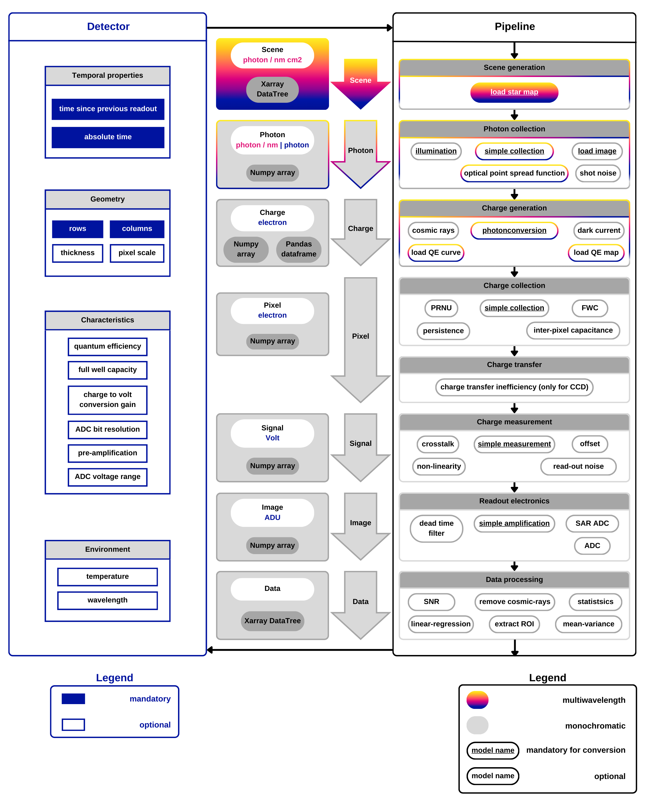

.. _architecture:

============
Architecture
============

There are three main elements behind Pyxel's architecture,
the :ref:`running_modes`, the :ref:`detectors` and the :ref:`pipeline`,
each of them represented by a class in the code.
See :ref:`apireference` for further information on the three types of classes.
The main user entry point for any Pyxel simulation is a configuration file.
All the three elements are defined before running Pyxel through the input YAML configuration file.
More on the configuration files in :ref:`yaml`

As illustrated below, the detector holds information about the detector properties such as geometry, characteristics,
material and environment. It is also a bucket for storing simulated data,
for example the incoming photons, stored charge in the pixels etc.
This data can be used and edited by any of models in the pipeline.
The pipeline is the core algorithm, hosting and running the models,
which are grouped into different model groups, levels imitating the working principles of the detector/instrument.

    Detection :ref:`Pipeline <pipeline>` and :ref:`Detector object <detectors>` of Pyxel