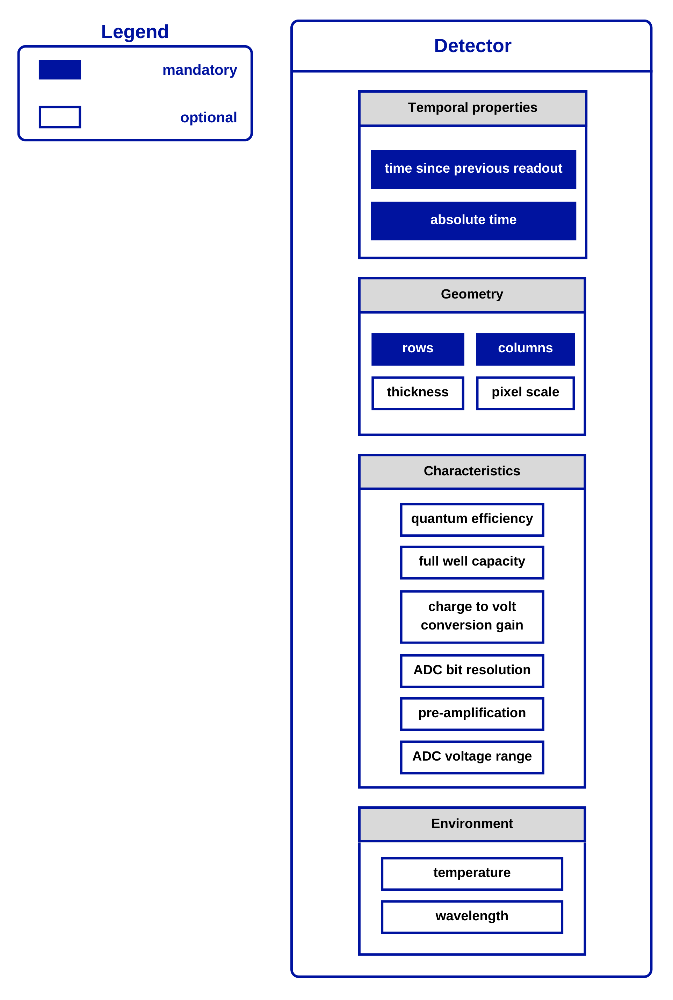

.. _detectors:

#########
Detectors
#########

The :py:class:`~pyxel.detectors.Detector` object is the main input of the detection pipeline.
Therefore it is a container for all the data that the models need access to inside the :ref:`pipeline`.
It is passed through all the including models represented by model functions.
According to the ``YAML`` configuration file, one :py:class:`~pyxel.detectors.Detector` object is
instantiated for each exposure.

.. _detector_properties:

Detector properties
===================

First group of the data buckets inside the :py:class:`~pyxel.detectors.Detector` object
are all the information and data related to the physical properties of the simulated detector,
falling in either of the following categories:
:py:class:`~pyxel.detectors.Geometry`, :py:class:`~pyxel.detectors.Characteristics`,
and :py:class:`~pyxel.detectors.Environment`, as shown in the figure.
Those are all the properties that are used by more than one model.
They do not change during a pipeline run and can vary depending on the detector used.
Another category of detector properties, ``Material``, was temporarily removed in version
1.0 due to non-use. Additionally, since version 1.0, properties were given user-friendly names with whole words
instead of symbols and abbreviations.

.. _data_structure:

Data
====

The detector also holds data buckets storing the simulated data, such as
input photon distribution (photons), number of charge carriers generated (carrier type), signal variation [#]_ in pixels
(voltage, phase), and digitised image value (ADU). The data buckets are modified by the models in the pipeline
and the state of the output detector at the end of the pipeline is changed.
These data structures are:
:py:class:`~pyxel.data_structure.Photon`, :py:class:`~pyxel.data_structure.Charge`,
:py:class:`~pyxel.data_structure.Pixel`, :py:class:`~pyxel.data_structure.Signal`
and :py:class:`~pyxel.data_structure.Image` class.

The classes are storing the data values either inside a Pandas
:py:class:`pandas.DataFrame` or in a NumPy :py:class:`numpy.ndarray`. Via DataFrame or
NumPy array handling functions, models can modify properties of photons,
charges, etc., like position, kinetic energy, number of electrons per charge packet,
signal amplitude, etc.

.. [#] Which is going to be a phase shift, in the case of MKIDs---once their underlying physics is fully implemented.

.. _time_properties:

Time properties
===============

As shown in the image, the :py:class:`~pyxel.detectors.Detector` object also tracks time.
There are multiple properties inside the :py:class:`~pyxel.detectors.Detector` object:
``time`` is the time since ``start_time`` (which can be different to 0), ``absolute time`` is the time since 0,
and ``time_step`` is the time since last readout. Those properties can be used by the time-sensitive models.

Implemented detector types:
===========================

.. toctree::
    detectors/ccd.rst
    detectors/cmos.rst
    detectors/mkid.rst
    detectors/apd.rst
