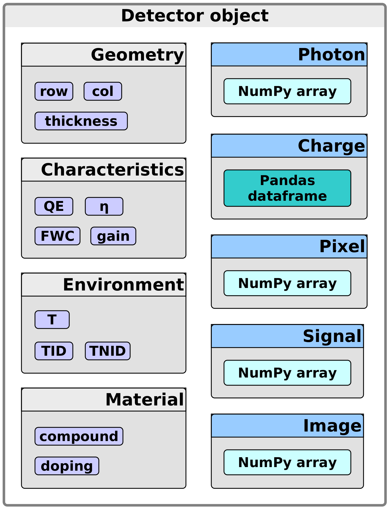

.. _detectors:

#########
Detectors
#########

According to the ``YAML`` file, one :py:class:`~pyxel.detectors.CCD` or
:py:class:`~pyxel.detectors.CMOS` :py:class:`~pyxel.detectors.Detector` object is
instantiated for each thread, inheriting from a general (abstract)
:py:class:`~pyxel.detectors.Detector` class.

The created :py:class:`~pyxel.detectors.Detector` object is the input of the
Detection :ref:`pipeline`, which is passed through all the including models
represented by functions. We can consider the :py:class:`~pyxel.detectors.Detector`
object as a bucket containing all information and data related to the physical
properties of the simulated detector (:py:class:`~pyxel.detectors.Geometry`,
:py:class:`~pyxel.detectors.Material`, :py:class:`~pyxel.detectors.Environment`,
:py:class:`~pyxel.detectors.Characteristics`), incident photons, created charge-carriers
and the generated signals we are interested in at the end of the simulation.

Implemented detector types:
===========================

.. toctree::
    detectors/ccd.rst
    detectors/cmos.rst
    detectors/mkid.rst
    detectors/apd.rst

.. _data_structure:

Detector properties
===================

.. _data_structure:

Data
====

Models in Pyxel should be able to add photons, charges, charge packets, signal [#]_ or
image pixel values to the corresponding data structure classes
(:py:class:`~pyxel.data_structure.Photon`, :py:class:`~pyxel.data_structure.Charge`,
:py:class:`~pyxel.data_structure.Pixel`, :py:class:`~pyxel.data_structure.Signal`
or :py:class:`~pyxel.data_structure.Image` class).

.. [#] Which is going to be a phase shift, in the case of MKIDs---once their underlying physics is fully implemented.

These classes are storing the data values either inside a Pandas
:py:class:`pandas.DataFrame` or in a NumPy :py:class:`numpy.ndarray`. Via DataFrame or
NumPy array handling functions, models can also modify properties of photons,
charges, etc., like position, kinetic energy, number of electrons per charge packet,
signal amplitude, etc.
