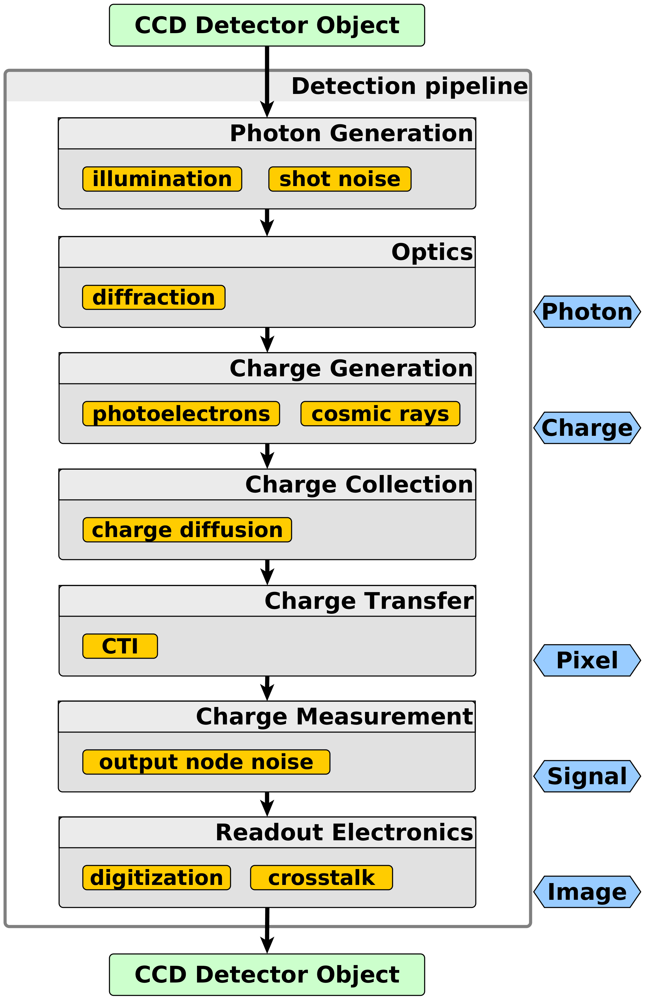

.. _pipelines:

#########
Pipelines
#########

The core algorithm of the architecture is the Detection pipeline allowing to
host any type of models in an arbitrary number. This is either a
*CCDDetectionPipeline* or a *CMOSDetectionPipeline* inheriting
subclasses, properties and functions from a general *DetectionPipeline* class.

Inside the pipeline the models are grouped into 7 different levels per
detector type imitating the working principle of the detector, for example
in case of a CCD the model levels are photon generation, optics, charge
generation, charge collection, charge transfer, charge measurement and
readout electronics in this order.

Each level is based on a
for loop, looping over all the included and selected models in a predefined
order, which can be changed by the user. All the models in a pipeline, get
and modify the same Detector object one after another. At the end, the
pipeline returns the Detector object as an output ready to generate
output files from results.

Models
======

By models, we mean various analytical functions, numerical methods or
algorithms implemented in order to approximate, calculate, visualize
electro-optical performance and degradation due to the operational
environment (space, laboratory test) and its effects (e.g. radiation
damage).

Models are Python functions with a Detector object defined as
their input argument. The model function has to be
added to the YAML configuration file.
Then the function is automatically called by Pyxel inside a loop of its
model group and the Detector object is passed to it. The model may modifies
this Detector object which is also used and modified further by the next
models in the pipeline.

**Model groups**

    Models are grouped into 7 model levels per detector type according to
    which object of the Detector object is used or modified by
    the models. These levels correspond roughly to the detector fundamental
    functions.

    Models in Pyxel makes changes and storing there data in data structure
    classes (Photon, Charge, Pixel, Signal or Image class).
    For details, see the :ref:`Data Structure <data_structure>` page.

    Models could also modify any detector attributes (like Quantum Efficiency,
    gains, temperature, etc.) stored in a Detector subclass (Characteristics,
    Environment, Material).

..
    Detector attributes changes could happen globally (on detector level)
    or locally (on pixel level or only for a specific detector area).

.. figure:: _static/model-table.png
    :scale: 70%
    :alt: models
    :align: center

    All the 8 model levels, which are imitating the physical working principles of imaging detectors. They were
    grouped according to which physics data storing objects are modified by them. Note that 2 out of the 8 levels are
    specific to a single detector type.

**Model inputs**

    Models functions have at least one compulsory input argument,
    which is either a general, a CCD or a CMOS type Detector object,
    depending on what the model is supposed to simulate:
    a general (e.g. cosmic rays),
    a CCD (e.g. CTI) or a CMOS (e.g. Alternating Column Noise) specific
    detector effect.

    Any other (optional) input arguments can be defined for the model as well,
    which will be loaded from the YAML file or GUI and passed to the model
    automatically.

**Adding a new model**

    Users and developers can easily add any kind of new or already existing
    model to Pyxel, thanks to the easy-to-use model plug-in mechanism
    developed for this purpose.

    For more details, see the :ref:`Adding new models <new_model>` page.
