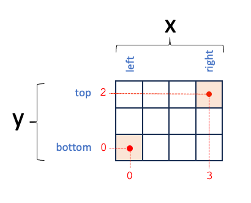

.. _pixel_coordinate_conventions:

============================
Pixel Coordinate Conventions
============================

In Pyxel, the pixel coordinates fall at the **center** of pixels.
Also, the first pixel corresponds to the center of the **leftmost bottom pyxel** and
has coordinates ``(0, 0)``.
The first pixel spans pixel values ``-0.5`` to ``0.5``.

Following Numpy indexing, the ``y`` coordinate corresponds to rows and
the ``x`` coordinate corresponds to columns.
See the following picture for more information.

    Pixel Coordinate Conventions in Pyxel with pixels ``(0, 0)`` and ``(2, 3)``
