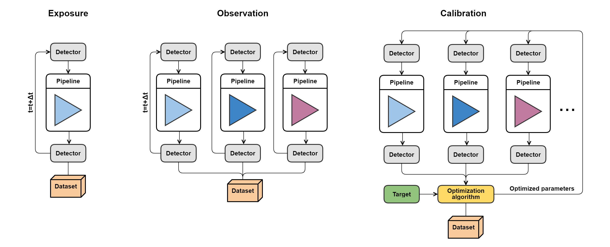

.. _running_modes:

=============
Running modes
=============

There are three running modes in Pyxel:

- :ref:`exposure_mode`: simulation of a single exposure, at a single or with incrementing readout times (quick look/ health check, simulation of non-destructive readout mode and time-dependent effects),
- :ref:`observation_mode`: multiple exposure pipelines looping over a range of model or detector parameters (sensitivity analysis),
- :ref:`calibration_mode`: optimize model or detector parameters to fit target data sets using a user-defined fitness function/figure of merit (model fitting, instrument optimization),

Results for all three running modes have the form of multidimensional datasets,
provided by the Python library `Xarray <https://docs.xarray.dev/en/stable/>`_ :cite:p:`xarray`.
Datasets can for example store detector data at different readout times in the case of exposure mode,
detector data at a different model or detector parameters in the case of observation modes,
and simulated data and calibrated model parameters in the case of calibration mode.

Click below for more information on the modes and corresponding ``YAML`` configurations.

.. toctree::
    running_modes/exposure_mode.rst
    running_modes/observation_mode.rst
    running_modes/calibration_mode.rst
