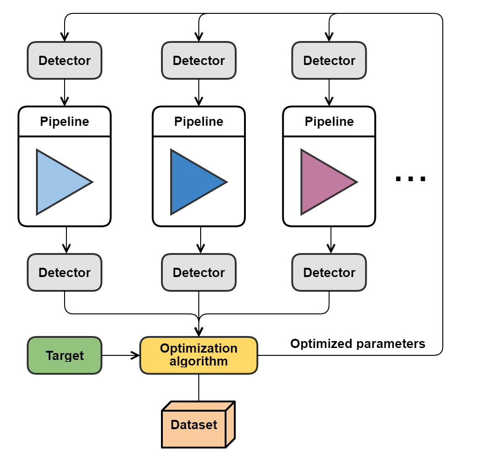

.. _calibration_mode:

================
Calibration mode
================

The purpose of calibration mode is to find the optimal input arguments
of models or optimal detector attributes based on a
target dataset the models or detector behaviour shall reproduce.
It is useful for calibrating models,
optimizing instrument performance or retrieving detector physical properties from measurements.
The optimization algorithm and optimised figure of merit are configurable.
The built-in optimization algorithms are advanced genetic algorithms based on the Pygmo package :cite:p:`pygmo`
ideal for wide/degenerate parameter space and non-linear problems.
It must be run in parallel since the number of pipelines that are run each time is very high.
Because of a heavy computation load, we use `Dask <https://www.dask.org//>`_
for parallelization, using multiple processor threads.

The architecture contains a data
comparator function to compare simulated and measured data, then via a
feedback loop, a function readjusts the model parameters (this function
can be user defined).
The Detection pipelines are re-run with the modified
Detector objects. This iteration continues until reaching the convergence,
i.e. we get a calibrated model fitted to the real, measured dataset.

Calibration with PyGMO
======================
Calibration of a model in PyGMO nomenclature goes as follows: each processor thread is called an ``island``.
On each island lives a population of ``individuals`` (solution candidates),
each randomly assigned with different ``chromosomes`` (model parameters).
The individual with the best ``fitness`` (best solution) is called the `champion`.
A group of islands is called an archipelago.
During the evolution population is evolved multiple times with a chosen ``algorithm``,
each ``evolution`` consisting of multiple `generations`.
The evolution is based on the principle of chromosome mutations.
Populations can also ``migrate`` between the islands, taking with them the information about the best individuals.
The result is that the individuals in the population get fitter and fitter.
Finally, the best champion from each of the islands is extracted which gives the best model parameters.

Example of a configuration file
===============================

.. code-block:: yaml

    calibration:

      result_type:          pixel

      result_fit_range:     [500, 835, 0, 1]
      target_fit_range:     [500, 835, 0, 1]
      result_input_arguments:
        - key: pipeline.charge_generation.load_charge.arguments.filename
          values: [ 'data/input/input_flex_ds7_ch0_1ke.txt',
                    'data/input/input_flex_ds7_ch0_3ke.txt']

      target_data_path:     ['data/target/target_flex_ds7_ch0_1ke.txt',
                             'data/target/target_flex_ds7_ch0_3ke.txt']

      pygmo_seed:               10
      num_islands:              10
      num_evolutions:           2
      num_best_decisions:       0

      algorithm:
        type:               sade
        generations:        10
        population_size:    20
        variant:            2

      fitness_function:
        func:               pyxel.calibration.fitness.sum_of_abs_residuals
        arguments:

      parameters:  # case for CDM model calibration with 9 parameters
        - key:              pipeline.charge_transfer.cdm.arguments.beta
          values:           _
          logarithmic:      false
          boundaries:       [0.1, 0.9]
        - key:              pipeline.charge_transfer.cdm.arguments.trap_release_times
          values:           [_, _, _, _]
          logarithmic:      true
          boundaries:       [1.e-5, 1.e-1]
        - key:              pipeline.charge_transfer.cdm.arguments.trap_densities
          values:           [_, _, _, _]
          logarithmic:      true
          boundaries:       [1.e-2, 1.e+2]

      outputs:
        output_folder:        'calibration_output'

Outputs
=======

User can save on disk contents of the detector (``pixel``,``signal``, and ``image`` arrays)
for every run of the pipeline, which is not recommended due to a large amount of pipelines run.
User can also save at the end of the simulation the ``dataset`` containing all the results in NetCDF,
as well as ``logs``.

.. code-block:: yaml

  calibration:

  ...

    outputs:
      output_folder:        'calibration_output'
      save_data_to_file:
        - detector.image.array:   ['fits']  # NOT RECOMMENDED
      save_calibration_data:
        - dataset: ['nc']
        - logs: ['csv', 'xlsx']