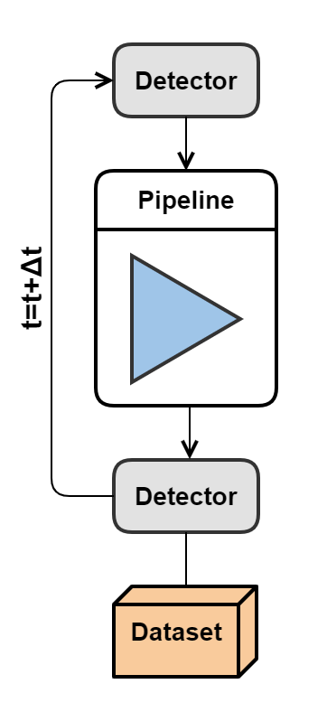

.. _exposure_mode:

=============
Exposure mode
=============

Pipeline is run one or more times, depending on the number of configurable readout times.
Useful for simple simulations, quick checks, and simulating time-dependent effects. Exposure mode cannot
be run in parallel.

Example of a configuration file
===============================

Single readout time
-------------------

Running Pyxel in Exposure mode can be used to get a single image with
the detector effects defined in either the configuration file.
If multiple readout times are not specified, the default readout time is 1 second.

.. code-block:: yaml

    exposure:

      outputs:
        output_folder: "output"

Multiple readout times (time-domain simulation)
-----------------------------------------------

The purpose of having multiple readout times is to execute the same pipeline
on the same detector object several times. In that case, time evolution of images is available as well.
Readout times have to be specified in the ``YAML`` file like shown below.
Users can also set the readout to non-destructive or destructive (non-destructive: false), set start time or upload times from a file.

The `non-destructive` mode is used to avoid resetting the detector object
and emptying the data at each iteration of the detector through the pipeline.

.. code-block:: yaml

  exposure:

    readout:
      times: numpy.linspace(1, 20, 50)
      non_destructive:  true

    outputs:
      output_folder: 'output'
.. code-block:: yaml

  exposure:

    readout:
      times_from_file: "data/exposure_times.npy"
      non_destructive:  true

    outputs:
      output_folder: 'output'

Outputs
=======

User can save on disk contents of the detector (``pixel``,``signal``, and ``image`` arrays)
for every run of the pipeline - every readout time.
User can also save at the end of the simulation the ``dataset`` containing all the results.

.. code-block:: yaml

    exposure:

      outputs:
        output_folder: "output"
        save_data_to_file:
          - detector.image.array:   ['fits', 'jpg', 'npy']
        save_exposure_data:
          - dataset: ['nc']  # NetCDF