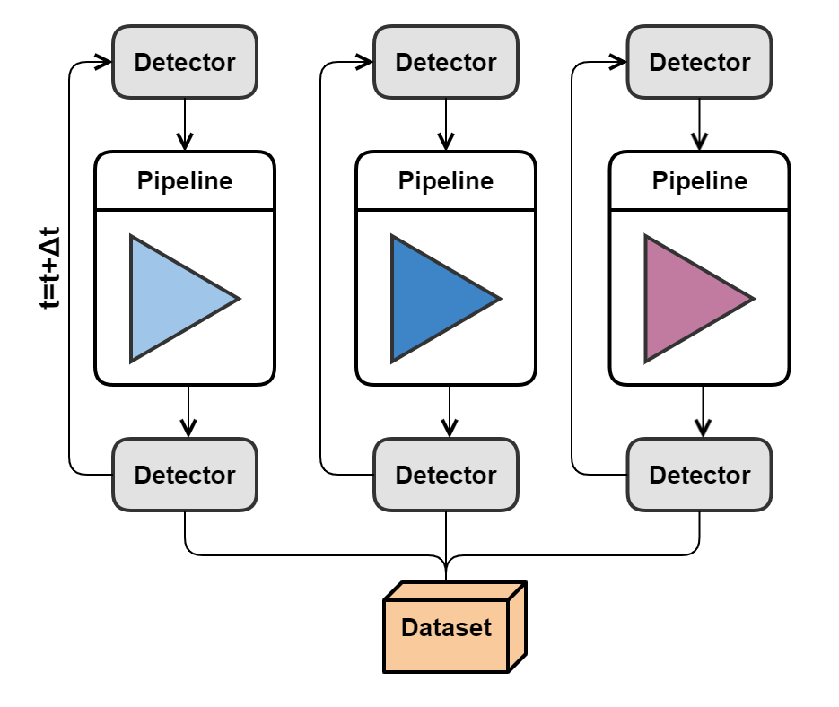

.. _observation_mode:

================
Observation mode
================

Multiple exposures looping over a range of model or detector parameters. Useful for parameter
sensitivity analysis, checks of parameter space, simulating variable astronomical sources, etc. Parallelization
is possible in observation mode.

The observation mode of Pyxel can automatically change the value of any
detector or model parameter to simulate an observation or make a sensitivity analysis for any parameter.
Iterating over different start times of exposures is also possible.

The variable parameter have to be defined in the ``YAML``
configuration file with ranges or lists. The framework generates and runs
a stack of different Detector objects and pipelines.

At the end, the user can plot and analyze the data
in function of the variable parameter.

Examples of configuration files for different modes
===================================================

There are three different modes of defining parameters:

Sequential
----------

.. code-block:: yaml

  # YAML config file for Observation mode (sequential)

  observation:

    mode: sequential
    parameters:
      - key:      pipeline.charge_generation.cosmix.arguments.particles_per_second
        values:   [1, 2, 3]
        enabled:  true
      - key:      pipeline.photon_collection.illumination.arguments.level
        values:   range(0, 300, 100)
        enabled:  true

    outputs:
      output_folder:  'outputs'

| The yaml file will start 6 runs in this order:
| number=1, number=2, number=3, level=0, level=100, level=200

The default values for 'number' and 'level' are defined as the arguments
of the specific models in the pipeline part of the yaml config file.

Product
-------

.. code-block:: yaml

  # YAML config file for Observation mode (product)

  observation:

    mode: product
    parameters:
      - key:      pipeline.charge_generation.cosmix.arguments.particles_per_second
        values:   [1, 2, 3]
        enabled:  true
      - key:      pipeline.photon_collection.illumination.arguments.level
        values:   range(0, 300, 100)
        enabled:  true

    outputs:
      output_folder:  'outputs'

| The yaml file will start 9 runs in this order:
| (number=1, level=0), (number=1, level=100), (number=1, level=200),
| (number=2, level=0), (number=2, level=100), (number=2, level=200),
| (number=3, level=0), (number=3, level=100), (number=3, level=200)

The default values for 'number' and 'level' are defined as the arguments
of the specific models in the pipeline part of the yaml config file.

Custom
------

.. code-block:: yaml

  # YAML config file for Observation mode (custom)

  observation:

    mode:  custom
    from_file:        'outputs/calibration_champions.out'
    column_range:     [2, 17]
    parameters:
      - key:      detector.characteristics.amp
        values:   _
      - key:      pipeline.charge_transfer.cdm.arguments.tr_p
        values:   [_, _, _, _]
      - key:      pipeline.charge_transfer.cdm.arguments.nt_p
        values:   [_, _, _, _]
      - key:      pipeline.charge_transfer.cdm.arguments.sigma_p
        values:   [_, _, _, _]
      - key:      pipeline.charge_transfer.cdm.arguments.beta_p
        values:   _
      - key:      detector.environment.temperature
        values:   _

    outputs:
      output_folder:  'outputs'

The parameter values (int, float or str) indicated with with '_' character,
and all are read and changed in parallel from an ASCII file defined
with ``from_file``.

Can be used for example to read results of calibration running mode
containing the champion parameter set for each generation, and create one
output fits image for each generation to see the evolution.

Outputs
=======

User can save on disk contents of the detector (``pixel``, ``signal`` and ``image`` arrays)
for every run of the pipeline - every parameter combination.
User can also save at the end of the simulation the ``dataset`` containing all the results,
as well as ``logs`` and ``parameters`` in NetCDF format.

.. code-block:: yaml

  # YAML config file for Observation mode (product)

  observation:

    parameters:
      - key:      pipeline.photon_collection.illumination.arguments.level
        values:   range(0, 300, 100)
        enabled:  true

    outputs:
      output_folder:  'outputs'
      save_data_to_file:
        - detector.image.array:   ['fits']  # saved for every pipeline/parameter
      save_observation_data:  # saved at the end
        - dataset: ['nc']  # NetCDF
        - logs: ['nc']  # NetCDF
        - parameters: ['nc']  # NetCDF

Using parallel computing
========================

For scenarios where there are large sets of parameters, the pipelines run slowly, or the result cannot fit in memory,
it is possible to run observation mode using the library ``dask``.

By enabling ``dask``, it also allows the system to efficiently manage data larger
than the available memory, enabling parallel computations and efficient memory usage on large-scale datasets.

Enabling ``dask``
-----------------

To enable parallel computing in Observation mode, set the ``with_dask`` option to ``true`` in the
YAML configuration file.

.. code-block:: yaml

  observation:

    with_dask: true

    parameters:
      - key:      pipeline.charge_generation.tars.arguments.particle_number
        values:   [1, 2, 3]
        enabled:  true

With this configuration, the pipelines with different parameters are grouped into
Dask Arrays (https://docs.dask.org/en/stable/array.html) and results are computed in parallel.
By default, ``dask`` uses the ``multiprocessing`` scheduler for parallelism.

Choosing the right scheduler
----------------------------

For optimal performance, especially when working in Jupyter notebooks, it is recommended to use the
``dask.distributed`` scheduler in combination with threads.
This allow the user to track the progress with the dask dashboard.

Here's how to configure the ``dask.distributed`` scheduler in Jupyter notebooks:

.. code-block:: python

    from distributed import Client

    client = Client()

Example of running and Observation mode with ``dask``
-----------------------------------------------------

Example of running the Observation mode.
At this level, the results are not yet computed or loaded in memory.

.. code-block:: python

    import pyxel
    from distributed import Client

    client = Client()  # Optional
    print(f"{client=}")

    # Load YAML configuration file
    config = pyxel.load("observation_with_dask.yaml")

    # Run observation mode
    data_tree = pyxel.run_mode(
        mode=config.running_mode,
        detector=config.detector,
        pipeline=config.pipeline,
    )

Compute the results and load them into memory.
Beware, the results may not fit in memory !

.. code-block:: python

    data_tree.load()

Compute the results and save them into a NetCDF file.

.. code-block:: python

    data_tree.to_netcdf("result.nc", engine="h5netcdf")

And load the results back.

.. code-block:: python

    from xarray.backends.api import open_datatree

    new_data_tree = open_datatree("result.nc")
