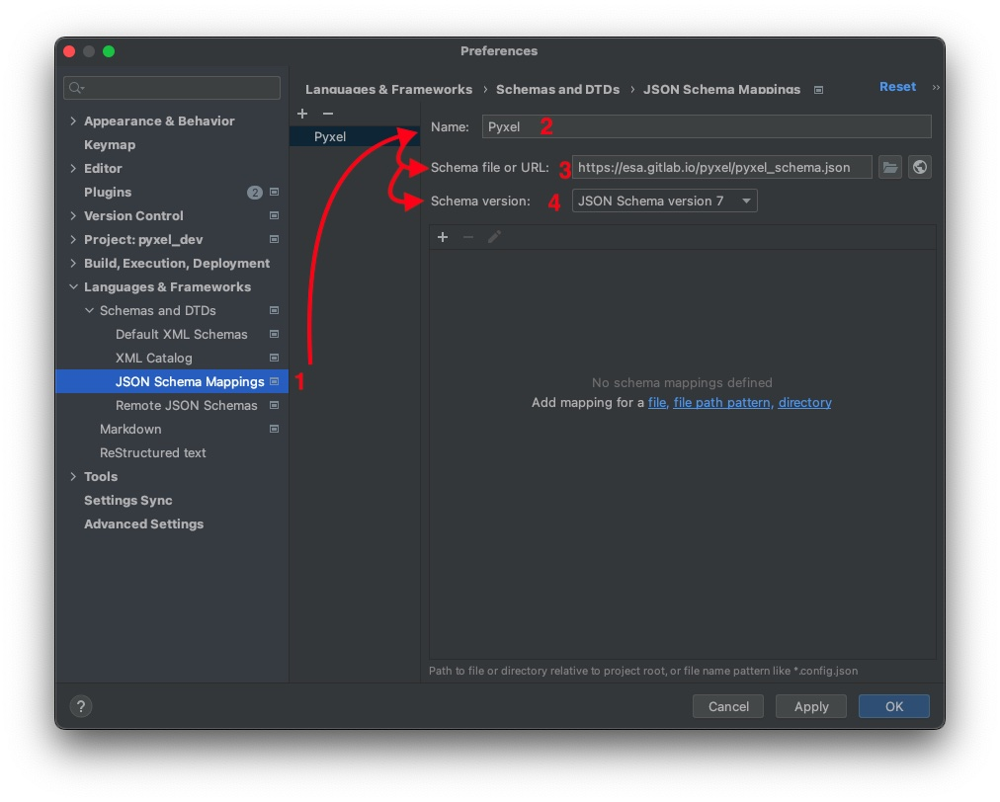
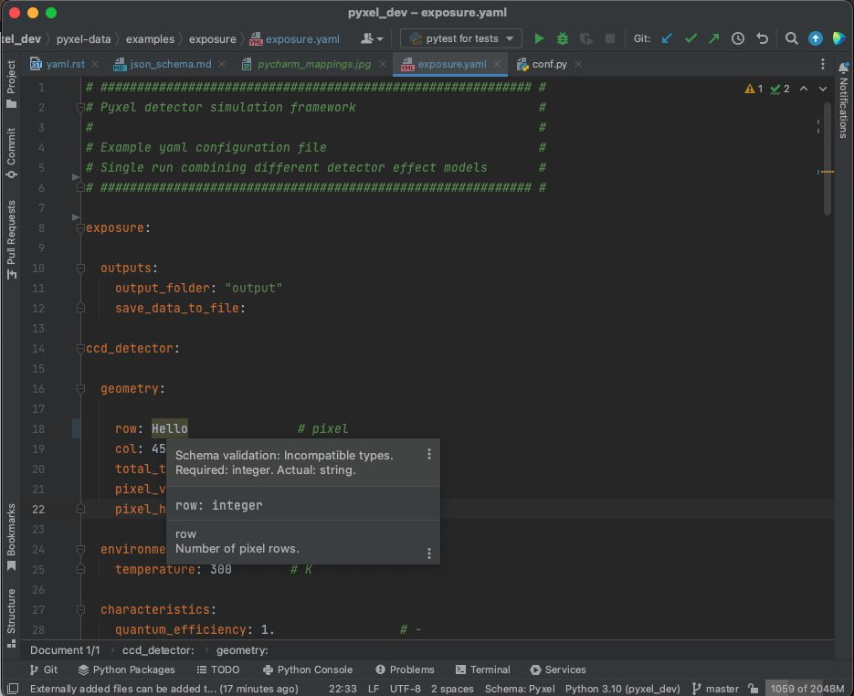
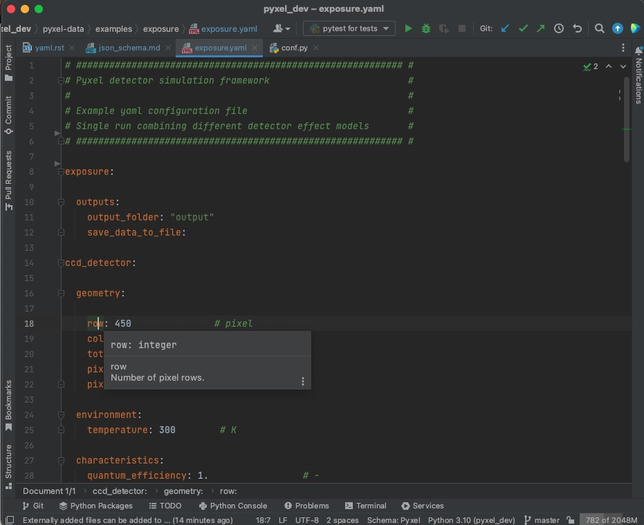
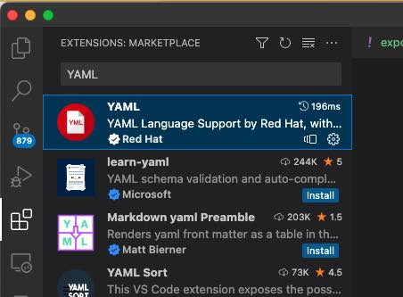
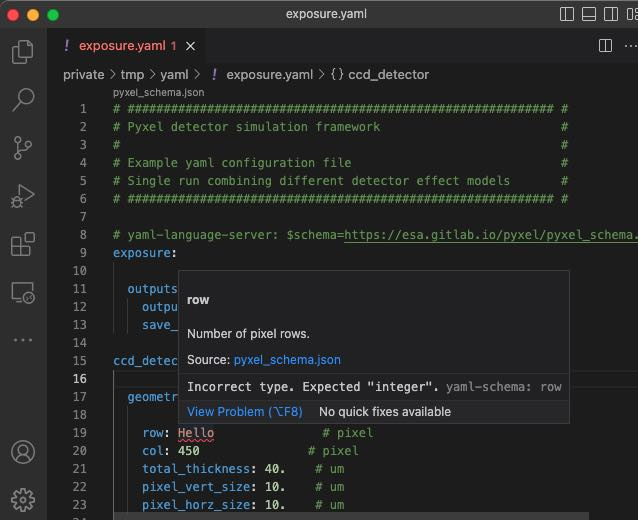
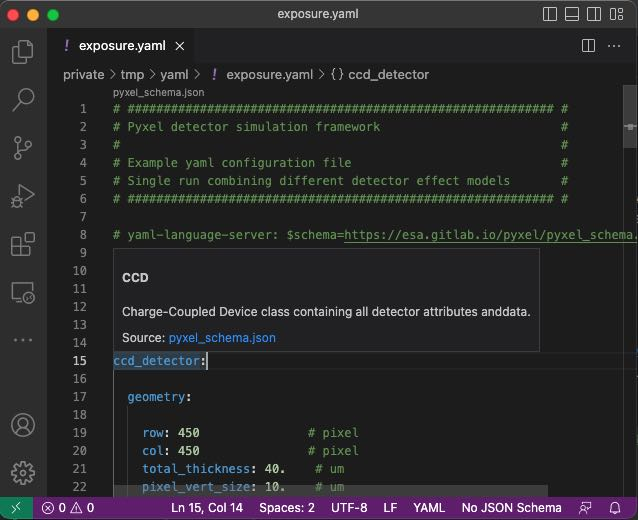

(json_schema)=
# How to use the Pyxel's JSON Schema

Pyxel provides a **JSON Schema** file using
[Draft 7 of the JSON Schema specification](https://json-schema.org/draft-07/json-schema-release-notes.html).

This **JSON Schema** file allows you to **annotate** and **validate** the Pyxel configuration files.

PyCharm, VSCode and Jupyter Lab support **JSON Schemas** and can offer auto-completion and validation to make sure
that the `YAML` configuration file is correct.

A good resource for learning about JSON Schema is the book
[Understanding JSON Schema](http://spacetelescope.github.com/understanding-json-schema) and
the [JSON Schema website](https://json-schema.org).


## PyCharm

All the steps use the Pyxel's JSON Schema with a `YAML` configuration are summarized in this video:

<video width="100%" controls>
  <source src="../_static/pycharm_json_schema.mp4" type="video/mp4">
  Your browser does not support the video tag.
</video>

### Add a JSON Schema Mappings

The first step is to add the Pyxel's JSON Schema into PyCharm.

You have to open the 'Preferences' (for MacOS) or 'Settings' (for Windows/Linux) and select
```Languages & Frameworks >> Schemas for DTDs >> JSON Schema Mappings```.
Then you add ``https://esa.gitlab.io/pyxel/pyxel_schema.json`` in field ``Schema file`` or URL and 
select ``JSON Schema version 7`` in field ``Schema version`` (see following picture)


### Associate to the Pyxel's JSON Schema

To associate the Pyxel's JSON Schema to the current `YAML` file, you must click on the ``schema`` icon in 
the bottom/left and select ``Pyxel``. See the current video:

<video width="100%" controls>
  <source src="../_static/pycharm_json_schema_associate.mp4" type="video/mp4">
  Your browser does not support the video tag.
</video>

### Example of validation

Finally you can check directly in PyCharm if your `YAML` Configuration file is valid: 

or visualize its annotation(s) . 


## Visual Studio Code

All the steps use the Pyxel's JSON Schema with a `YAML` configuration are summarized in this video:

<video width="100%" controls>
  <source src="../_static/vscode_json_schema.mp4" type="video/mp4">
  Your browser does not support the video tag.
</video>

### Install the YAML Language extension

The first step is to install the [YAML extension](https://marketplace.visualstudio.com/items?itemName=redhat.vscode-yaml) 
from Red Hat in VS Code directly in the Extension Manager of VSCode (see the following picture)



### Associate to the Pyxel's JSON Schema

Then you must specify the [Pyxel JSON Schema](https://esa.gitlab.io/pyxel/pyxel_schema.json) file to use in 
your configuration file  by adding the following line to the top of your `YAML` file:

```yaml
# yaml-language-server: $schema=https://esa.gitlab.io/pyxel/pyxel_schema.json
exposure:

  readout:
    times: [1., 5., 7.]
    non_destructive:  false

...
```

### Example of validation

Finally you can check directly in VSCode if your `YAML` Configuration file is valid: 

or visualize its annotation(s) . 

## JupyterLab

All the steps use the Pyxel's JSON Schema with a `YAML` configuration are summarized in this video:

<video width="100%" controls>
  <source src="../_static/jupyterlab_json_schema.mp4" type="video/mp4">
  Your browser does not support the video tag.
</video>

### Install the YAML Language extension

The first step is to install [JupyterLab Language Server Protocol](https://jupyterlab-lsp.readthedocs.io)
with the following commands:

**Notes**: This is only possible in a Conda/Anaconda environment.

```bash
conda install -c conda-forge jupyterlab jupyterlab-lsp nodejs
npm install yaml-language-server
```

### Associate to the Pyxel's JSON Schema

Then you must specify the [Pyxel JSON Schema](https://esa.gitlab.io/pyxel/pyxel_schema.json) file to use in 
your configuration file  by adding the following line to the top of your `YAML` file:

```yaml
# yaml-language-server: $schema=https://esa.gitlab.io/pyxel/pyxel_schema.json
exposure:

  readout:
    times: [1., 5., 7.]
    times: [1., 5., 7.]
    non_destructive:  false

...
```

### Example of validation

Finally you can check directly in JupyterLab if your `YAML` Configuration file is valid: 
