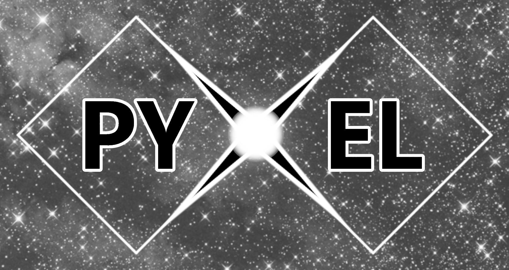

.. _overview:

Overview
========

Pyxel is a novel, open-source, modular Python software framework designed
to host and pipeline models (analytical, numerical, statistical) simulating
different types of detector effects on images produced by Charge-Coupled
Devices (CCD), Monolithic, and Hybrid CMOS imaging sensors.

Users can provide one or more input images to Pyxel, set the detector and
model parameters via a user interface (configuration file or graphical
interface) and select which effects to simulate: cosmic rays, detector
Point Spread Function (PSF), electronic noises, Charge Transfer Inefficiency
(CTI), persistence, dark current, charge diffusion, optical effects, etc.
The output is one or more images including the simulated detector effects
combined.

.. figure:: _static/Pyxel-example-transparent.png
    :alt: example
    :align: center

    Examples of output images created using Pyxel.
    Left: original image;
    centre: tracks of cosmic ray protons have been added;
    right: in addition to the cosmic ray protons tracks the effects
    of lower full well capacity and charge transfer inefficiency have been added.

On top of its model hosting capabilities, the framework also provides a set
of basic image analysis tools and an input image generator as well. It also
features a parametric mode to perform parametric and sensitivity analysis,
and a model calibration mode to find optimal values of its parameters
based on a target dataset the model should reproduce.

A majority of Pyxel users are expected to be detector scientists and
engineers working with instruments - using detectors - built for astronomy
and Earth observation, who need to perform detector simulations, for example
to understand laboratory data, to derive detector design specifications for
a particular application, or to predict instrument and mission performance
based on existing detector measurements.

One of the main purposes of this new tool is to share existing resources
and avoid duplication of work. For instance, a concrete need at ESA is
that detector models developed for a certain project could be reused by
other projects as well, making knowledge transfer easier.

Pyxel is built with modularity and flexibility in mind and makes use of
the GitLab infrastructure for version control and to support collaborative
development. Therefore it shall be easy for its user community to directly
contribute and expand the framework capabilities by adding their own models.

:cite:`2018:lucsanyi`

:cite:`2001:janesick`

:cite:`2015:rauscher`

:cite:`2013:short`

:cite:`2016:prodhomme`

:cite:`2003:agostinelli,2016:verhoeve`

