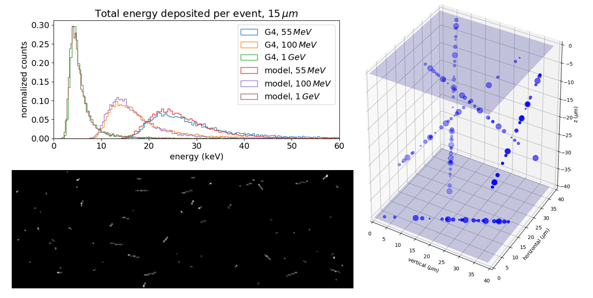

.. _charge_generation:

========================
Charge Generation models
========================

.. currentmodule:: pyxel.models.charge_generation
.. automodule:: pyxel.models.charge_generation


.. _charge_generation_create_store_detector:

Create and Store a detector
===========================

The models :ref:`charge_generation_save_detector` and :ref:`charge_generation_load_detector`
can be used respectively to create and to store a :py:class:`~pyxel.detectors.Detector` to/from a file.

These models can be used when you want to store or to inject a :py:class:`~pyxel.detectors.Detector`
into the current :ref:`pipeline`.

.. _charge_generation_save_detector:

Save detector
-------------

This model saves the current :py:class:`~pyxel.detectors.Detector` into a file.
Accepted file formats are ``.h5``, ``.hdf5``, ``.hdf`` and ``.asdf``.

.. code-block:: yaml

    - name: save_detector
      func: pyxel.models.save_detector
      enabled: true
      arguments:
        filename: my_detector.h5

.. autofunction:: pyxel.models.save_detector
   :noindex:


.. _charge_generation_load_detector:

Load detector
-------------

This model loads a :py:class:`~pyxel.detectors.Detector` from a file and injects it in the current pipeline.
Accepted file formats are ``.h5``, ``.hdf5``, ``.hdf`` and ``.asdf``.

.. code-block:: yaml

    - name: load_detector
      func: pyxel.models.load_detector
      enabled: true
      arguments:
        filename: my_detector.h5

.. autofunction:: pyxel.models.load_detector
   :noindex:


.. _Simple photoconversion:

Simple photoconversion
======================

:guilabel:`Photon` → :guilabel:`Charge`

With this model you can create and add charge to :py:class:`~pyxel.detectors.Detector` via photoelectric effect
by converting photons in charge.
Binomial sampling of incoming Poisson distributed photons is used in the conversion by default,
with probability :term:`QE`. It can be turned off by setting the argument ``binomial_sampling`` to ```False``.
User can provide an optional quantum efficiency (``qe``) parameter.
If not provided, quantum efficiency from detector :py:class:`~pyxel.detectors.Characteristics` is used.
It is also possible to set the seed of the random generator with the argument ```seed``.

Basic example of YAML configuration model:

.. code-block:: yaml

    - name: simple_conversion
      func: pyxel.models.charge_generation.simple_conversion
      enabled: true
      arguments:
        qe: 0.8  # optional

.. autofunction:: simple_conversion

.. warning:: Model assumes shot noise model was applied to photon array when using binomial sampling.

.. _Conversion with custom QE map:

Conversion with custom QE map
=============================

:guilabel:`Photon` → :guilabel:`Charge`

With this model you can create and add charge to :py:class:`~pyxel.detectors.Detector` via photoelectric effect
by converting photons in charge.
Binomial sampling of incoming Poisson distributed photons is used in the conversion by default,
with probability :term:`QE`. It can be turned off by setting the argument ``binomial_sampling`` to ```False``.
Besides that, user can input a custom quantum efficiency map by providing a ``filename`` of the :term:`QE` map.
Accepted file formats for :term:`QE` map are ``.npy``, ``.fits``, ``.txt``, ``.data``, ``.jpg``, ``.jpeg``, ``.bmp``,
``.png`` and ``.tiff``. Use argument ``position`` to set the offset from (0,0) pixel
and set where the input :term:`QE` map is placed onto detector. You can set preset positions with argument ``align``.
Values outside of detector shape will be cropped.
Read more about placement in the documentation of function :py:func:`~pyxel.util.fit_into_array`.

Basic example of YAML configuration model:

.. code-block:: yaml

    - name: conversion_with_qe_map
      func: pyxel.models.charge_generation.conversion_with_qe_map
      enabled: true
      arguments:
        filename: data/qe_map.npy

.. autofunction:: conversion_with_qe_map

.. warning:: Model assumes shot noise model was applied to photon array when using binomial sampling.

.. _Load charge:

Load charge
===========

:guilabel:`Charge` → :guilabel:`Charge`

With this model you can add charge to :py:class:`~pyxel.detectors.Detector` by loading charge values from a file.
Accepted file formats are ``.npy``, ``.fits``, ``.txt``, ``.data``, ``.jpg``, ``.jpeg``, ``.bmp``,
``.png`` and ``.tiff``. Use argument ``position`` to set the offset from (0,0) pixel
and set where the input charge is placed onto detector. You can set preset positions with argument ``align``.
Values outside of detector shape will be cropped.
Read more about placement in the documentation of function :py:func:`~pyxel.util.fit_into_array`.
Use argument ``time_scale`` to set the time scale of the input charge, default is 1 second.

Basic example of YAML configuration model:

.. code-block:: yaml

    - name: load_charge
      func: pyxel.models.photon_generation.load_charge
      enabled: true
      arguments:
        charge_file: data/charge.npy
        position: [0,0]

.. autofunction:: load_charge

.. _Charge injection:

Charge injection
================

:guilabel:`Charge` → :guilabel:`Charge`

With this model you can inject arbitrary charge block into rows of a :py:class:`~pyxel.detectors.CCD` detector.
Charge will be injected uniformly from row number `block_start` to row number `block_end`.

Example of YAML configuration model:

.. code-block:: yaml

    - name: charge_blocks
      func: pyxel.models.charge_generation.charge_blocks
      enabled: true
      arguments:
        charge_level: 100
        block_start: 10
        block_end: 50

.. note:: This model is specific for the :term:`CCD` detector.

.. autofunction:: charge_blocks

.. _Charge deposition model:

Charge deposition model
=======================

:guilabel:`Charge` → :guilabel:`Charge`

With this model it is possible to simulate the deposition of charge in the detector by ionized particles using user-provided stopping power curves.
It is possible to simulate mono-energetic beams (with a certain spread in energy) or provide an energy distribution (e.g., representative of the radiation environment).
Stopping power curves for protons in silicon and for protons in MCT alloy are provided. Similarly, the proton energy distribution at L2 with and without 11-mm aluminium shielding is provided within Pyxel.
This model is not as realistic as CosmiX but it is faster and easier to apply to a wide range of material and particles.
In particular due to its simplistic nature, it fails at reproducing the deposition of only a small amount of charge.

Example of the configuration file:


.. code-block:: yaml

    - name: charge_deposition
      func: pyxel.models.charge_generation.charge_deposition_in_mct
      enabled: true
      arguments:
        flux: 100
        step_size: 1.
        energy_mean: 1.
        energy_spread: .1
        energy_spectrum: data/proton_L2_solarMax_NoShielding.txt
        energy_spectrum_sampling: log
        ehpair_creation: 3.6
        material_density: 2.33
        particle_direction: isotropic
        stopping_power_curve: data/protons-in-silicon_stopping-power.csv

.. autofunction:: pyxel.models.charge_generation.charge_deposition


.. _Charge deposition model in MCT:

Charge deposition model in MCT
==============================

:guilabel:`Charge` → :guilabel:`Charge`

This model is the same as charge deposition model but is specific to MCT material. It computes the e-h pair creation (assuming it is 3 times the bandgap) and the alloy density based on the detector temperature and cut-off wavelength.

Example of the configuration file:


.. code-block:: yaml

    - name: charge_deposition
      func: pyxel.models.charge_generation.charge_deposition_in_mct
      enabled: true
      arguments:
        flux: 100
        step_size: 1.
        energy_mean: 1.
        energy_spread: .1
        energy_spectrum: data/proton_L2_solarMax_NoShielding.txt
        energy_spectrum_sampling: log
        cutoff_wavelength: 2.5
        particle_direction: isotropic
        stopping_power_curve: data/mct-stopping-power.csv
        
.. autofunction:: pyxel.models.charge_generation.charge_deposition_in_mct

.. _CosmiX cosmic ray model:

CosmiX cosmic ray model
=======================

:guilabel:`Charge` → :guilabel:`Charge`

A cosmic ray event simulator was the first model added to Pyxel.
Initially it was a simple, semi-analytical model in Fortran using the stopping
power curve of protons to optimize the on-board source detection algorithm
of the Gaia telescope to discriminate between stars and cosmic rays. Then it
was reimplemented in Python as TARS (Tools for Astronomical Radiation
Simulations) and later as CosmiX.

With this model you can add the effect of cosmic rays to the :py:class:`~pyxel.data_structure.Charge` data structure.
See the documentation below for descriptions of parameters.
CosmiX model is described in detail in :cite:p:`2020:cosmix`.

* Developed by: David Lucsanyi, ESA



    CosmiX cosmix ray model


Example of the configuration file:

.. code-block:: yaml

    - name: cosmix
      func: pyxel.models.charge_generation.cosmix
      enabled: true
      arguments:
        simulation_mode: cosmic_ray
        running_mode: "stepsize"
        particle_type: proton
        initial_energy: 100.          # MeV
        particles_per_second: 100
        incident_angles:
        starting_position:
        spectrum_file: 'data/proton_L2_solarMax_11mm_Shielding.txt'
        seed: 4321

.. autofunction:: pyxel.models.charge_generation.cosmix

.. _Dark current:

Dark current
============

:guilabel:`Charge` → :guilabel:`Charge`

With this model you can add a temperature dependent dark current to charge data,
stored in the a :py:class:`~pyxel.detectors.Detector` object.
The model follows the description in :cite:p:`Konnik:noises`.
The average dark current rate (in :math:`e^-/s/pixel`) is:

:math:`D_R=\frac{D_{FM}P_S}{qT_{RM}^{3/2}e^{-E_{g,RM}/-2k_B T_{RM}}} T^{3/2} e^{-E_g/2k_BT}`,

where

:math:`T` is temperature, :math:`T_{RM}` room temperature (:math:`300 K`), :math:`E_{g}` band gap,
:math:`k_B` Boltzmann constant, :math:`D_{FM}` dark current figure of merit,
:math:`P_S` pixel area, :math:`q` charge of an electron and :math:`E_{g, RM}` band gap at room temperature.
The entire dark current during exposure is:

:math:`I_{dark}=\mathcal{P}(t_{exp}D_R)(1+\mathcal{lnN}(0, \sigma^2_{fpn}))`,

where :math:`\sigma_{fpn}=t_{exp} D_R D_N`, :math:`\mathcal{P}` Poisson distribution,
:math:`\mathcal{lnN}` log-normal distribution, :math:`D_N` the dark current spatial noise factor
and :math:`t_{exp}` exposure time.

To use the model,
user has to provide arguments ``figure_of_merit`` in :math:`nA/cm^2` (:math:`D_{FM}`),
``band_gap`` in :math:`eV`, ``band_gap_room_temperature`` in :math:`eV`,
``spatial_noise_factor`` (:math:`D_N`) and ``temporal_noise``.
Parameter ``temperature`` in :math:`K` is taken from detector :py:class:`~pyxel.detectors.Environment`.
If arguments ``band_gap`` and ``band_gap_room_temperature`` are not provided,
the model will use the Varshni empirical formula with parameters for Silicon by default:

:math:`E_{gap}(T) = E_{gap}(0) - \frac{\alpha T^2}{T+\beta}`.

For Silicon, material constants are :math:`E_{gap}(0)=1.1577[eV]`, :math:`\alpha=7.021\times10^{-4}[eV/K]`,
and :math:`\beta=1108[K]`.

Example of the configuration file:

.. code-block:: yaml

    - name: dark_current
      func: pyxel.models.charge_generation.dark_current
      enabled: true
      arguments:
        figure_of_merit: 1.  # nA/cm^2
        band_gap: 1.2  # eV, optional
        band_gap_room_temperature: 1.2  # eV, optional
        spatial_noise_factor: 0.01
        temporal_noise: false

.. autofunction:: pyxel.models.charge_generation.dark_current

.. _Dark current rule07:

Dark current rule07
===================

:guilabel:`Charge` → :guilabel:`Charge`

With this model you can add dark current to :py:class:`~pyxel.data_structure.Charge` following the
model described in :cite:p:`Tennant2008MBEHT`.
This model is only valid for :term:`MCT` hybridised array (:term:`MCT` + :term:`CMOS`).
The model has one extra argument: ``cut-off wavelength``, and also takes some values from :py:class:`~pyxel.detectors.Detector` object,
to be precise: ``temperature``, ``pixel size`` (assuming it is square),
and ``time step`` since last read-out.
Please make sure the detector :py:class:`~pyxel.detectors.Environment`, :py:class:`~pyxel.detectors.Geometry` and
:py:class:`~pyxel.detectors.Characteristics` are properly set in the ``YAML`` configuration file.

Example of the configuration file:

.. code-block:: yaml

    - name: dark_current
      func: pyxel.models.charge_generation.dark_current_rule07
      enabled: true
      arguments:
        cutoff_wavelength: 2.5
        spatial_noise_factor: 0.01
        temporal_noise: true

.. note:: This model is specific for the :term:`MCT` and :term:`CMOS` detector.

.. autofunction:: pyxel.models.charge_generation.dark_current_rule07    

.. _Simple dark current:

Simple dark current
===================

:guilabel:`Charge` → :guilabel:`Charge`

With this model you can add dark current to a :py:class:`~pyxel.detectors.Detector` object.

Example of the configuration file:

.. code-block:: yaml

    - name: simple_dark_current
      func: pyxel.models.charge_generation.simple_dark_current
      enabled: true
      arguments:
        dark_rate: 10.0

.. autofunction:: pyxel.models.charge_generation.simple_dark_current

.. _APD gain:

APD gain
========

:guilabel:`Charge` → :guilabel:`Charge`

With this model you can apply APD gain to the a :py:class:`~pyxel.detectors.APD` object.
Model simply multiplies the values of charge with the avalanche gain,
which should be specified in the detector characteristics.

Example of the configuration file:

.. code-block:: yaml

    - name: apd_gain
      func: pyxel.models.charge_generation.apd_gain
      enabled: true

.. note:: This model is specific to the :term:`APD` detector.

.. autofunction:: pyxel.models.charge_generation.apd_gain

.. _Dark current Saphira:

Dark current Saphira
====================

:guilabel:`Charge` → :guilabel:`Charge`

With this empirical model you can add dark current to a :py:class:`~pyxel.detectors.APD` object.
The model is an approximation the dark current vs. gain vs. temp plot in :cite:p:`2019:baker`, Fig. 3.
We can split it into three linear 'regimes': 1) low-gain, low dark current; 2) nominal; and 3) trap-assisted tunneling.
The model ignores the first one for now since this only applies at gains less than ~2.
All the necessary arguments are provided through the detector characteristics.
The model works best for ``temperature`` less than 100 and ``avalanche gain`` more than 2.

Example of the configuration file:

.. code-block:: yaml

    - name: dark_current_saphira
      func: pyxel.models.charge_generation.dark_current_saphira
      enabled: true

.. note:: This model is specific to the :term:`APD` detector.

.. note:: Dark current calculated with this model already takes into account the avalanche gain.

.. autofunction:: pyxel.models.charge_generation.dark_current_saphira
