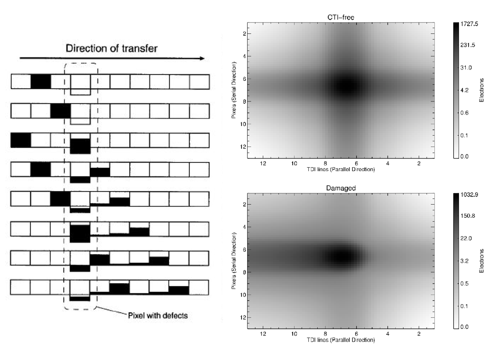

.. _charge_transfer:

============================
Charge Transfer models (CCD)
============================

.. important::
    This model group is only for :term:`CCD` detectors!

.. currentmodule:: pyxel.models.charge_transfer

.. _charge_transfer_create_store_detector:

Create and Store a detector
===========================

The models :ref:`charge_transfer_save_detector` and :ref:`charge_transfer_load_detector`
can be used respectively to create and to store a :py:class:`~pyxel.detectors.Detector` to/from a file.

These models can be used when you want to store or to inject a :py:class:`~pyxel.detectors.Detector`
into the current :ref:`pipeline`.

.. _charge_transfer_save_detector:

Save detector
-------------

This model saves the current :py:class:`~pyxel.detectors.Detector` into a file.
Accepted file formats are ``.h5``, ``.hdf5``, ``.hdf`` and ``.asdf``.

.. code-block:: yaml

    - name: save_detector
      func: pyxel.models.save_detector
      enabled: true
      arguments:
        filename: my_detector.h5

.. autofunction:: pyxel.models.save_detector
   :noindex:

.. _charge_transfer_load_detector:

Load detector
-------------

This model loads a :py:class:`~pyxel.detectors.Detector` from a file and injects it in the current pipeline.
Accepted file formats are ``.h5``, ``.hdf5``, ``.hdf`` and ``.asdf``.

.. code-block:: yaml

    - name: load_detector
      func: pyxel.models.load_detector
      enabled: true
      arguments:
        filename: my_detector.h5

.. autofunction:: pyxel.models.load_detector
   :noindex:

.. _Charge Distortion Model (CDM):

Charge Distortion Model (CDM)
=============================

:guilabel:`Pixel` → :guilabel:`Pixel`

The Charge Distortion Model - CDM :cite:p:`2013:short` describes the effects of the radiation
damage causing charge deferral and image shape distortion. The analytical
model is physically realistic, yet fast enough. It was developed specifically
for the Gaia CCD operating mode, implemented in Fortran and Python. However,
a generalized version has already been applied in a broader context, for
example to investigate the impact of radiation damage on the Euclid mission.
This generalized version has been included and used in Pyxel.

Use this model to add radiation induced :term:`CTI` effects to :py:class:`~pyxel.data_structure.Pixel` array of the
to :py:class:`~pyxel.detectors.CCD` detector. Argument ``direction`` should be set as either ``"parallel"``
for parallel direction :term:`CTI` or ``"serial"`` for serial register :term:`CTI`.
User should also set arguments ``trap_release_times``, ``trap_densities`` and ``sigma``
as lists for an arbitrary number of trap species. See below for descriptions.
Other arguments include ``max_electron_volume``, ``transfer_period``,
``charge injection`` for parallel mode and ``full_well_capacity`` to override the one set in
detector :py:class:`~pyxel.detectors.Characteristics`.

    CDM (Charge Distortion Model)

Example of the configuration file.

.. code-block:: yaml

    - name: cdm
      func: pyxel.models.charge_transfer.cdm
      enabled: true
      arguments:
        direction: "parallel"
        trap_release_times: [0.1, 1.]
        trap_densities: [0.307, 0.175]
        sigma: [1.e-15, 1.e-15]
        beta: 0.3
        max_electron_volume: 1.e-10,
        transfer_period: float = 1.e-4,
        charge_injection: true  # only used for parallel mode
        full_well_capacity: 1000.  # optional (otherwise one from detector characteristics is used)

.. note:: This model is specific for the :term:`CCD` detector.

.. autofunction:: cdm

.. _Add CTI trails (ArCTIc):

Add CTI trails
==============

:guilabel:`Pixel` → :guilabel:`Pixel`

Add image trails due to charge transfer inefficiency in :term:`CCD` detectors by modelling the
trapping, releasing, and moving of charge along pixels.

The primary inputs are the initial image followed by the properties of the :term:`CCD`,
readout electronics and trap species for serial clocking.

More information about adding :term:`CTI` trailing is described
in section 2.1 in :cite:p:`2010:massey`.

Example of the configuration file:

.. code-block:: yaml

    - name: arctic_add
      func: pyxel.models.charge_transfer.arctic_add
      enabled: true
      arguments:
        well_fill_power: 10.
        trap_densities: [1., 2., 3.]                # Add three traps
        trap_release_timescales: [10., 20., 30.]
        express: 0

.. autofunction:: arctic_add

.. _Remove CTI trails (ArCTIc):

Remove CTI trails
=================

:guilabel:`Pixel` → :guilabel:`Pixel`

Remove :term:`CTI` trails is done by iteratively modelling the addition of :term:`CTI`, as described
in :cite:p:`2010:massey` section 3.2 and Table 1.

Example of the configuration file:

.. code-block:: yaml

    - name: arctic_remove
      func: pyxel.models.charge_transfer.arctic_remove
      enabled: true
      arguments:
        well_fill_power: 10.
        instant_traps:                      # Add two traps
          - density: 1.0
            release_timescale: 10.0
          - density: 2.0
            release_timescale: 20.0
        express: 0

.. autofunction:: arctic_remove

EMCCD Model
===========

:guilabel:`Pixel` → :guilabel:`Pixel`

TBW.