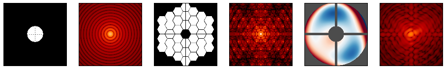

.. _optical:

==============
Optical models
==============

.. currentmodule:: pyxel.models.optics
.. automodule:: pyxel.models.optics

.. _optical_create_store_detector:

Create and Store a detector
===========================

The models :ref:`optical_save_detector` and :ref:`optical_load_detector`
can be used respectively to create and to store a :py:class:`~pyxel.detectors.Detector` to/from a file.

These models can be used when you want to store or to inject a :py:class:`~pyxel.detectors.Detector`
into the current :ref:`pipeline`.

.. _optical_save_detector:

Save detector
-------------

This model saves the current :py:class:`~pyxel.detectors.Detector` into a file.
Accepted file formats are ``.h5``, ``.hdf5``, ``.hdf`` and ``.asdf``.

.. code-block:: yaml

    - name: save_detector
      func: pyxel.models.save_detector
      enabled: true
      arguments:
        filename: my_detector.h5

.. autofunction:: pyxel.models.save_detector
   :noindex:

.. _optical_load_detector:

Load detector
-------------

This model loads a :py:class:`~pyxel.detectors.Detector` from a file and injects it in the current pipeline.
Accepted file formats are ``.h5``, ``.hdf5``, ``.hdf`` and ``.asdf``.

.. code-block:: yaml

    - name: load_detector
      func: pyxel.models.load_detector
      enabled: true
      arguments:
        filename: my_detector.h5

.. autofunction:: pyxel.models.load_detector
   :noindex:

.. _Physical Optics Propagation in PYthon (POPPY):

Physical Optics Propagation in PYthon (POPPY)
=============================================

:guilabel:`Photon` → :guilabel:`Photon`

POPPY (**P**\ hysical **O**\ ptics **P**\ ropagation in **PY**\ thon) model wrapper.

POPPY :cite:p:`10.1117/12.925230` simulated physical optical propagation including diffraction.
It implements a flexible framework for modeling Fraunhofer and Fresnel diffraction and point spread function formation,
particularly in the context of astronomical telescopes.

POPPY calculates the optical Point Spread Function of an optical system and applies the convolution.

* Developed by: Marshall Perrin et al., STScI
* Developed for: James Webb Space Telescope
* Documentation: https://poppy-optics.readthedocs.io
* Project link: https://github.com/spacetelescope/poppy

See details about POPPY Optical Element classes:
https://poppy-optics.readthedocs.io/en/stable/available_optics.html

    POPPY (Physical Optics Propagation in Python), Credit: STScI

Supported optical elements:

- ``CircularAperture``
- ``SquareAperture``
- ``RectangularAperture``
- ``HexagonAperture``
- ``MultiHexagonalAperture``
- ``ThinLens``
- ``SecondaryObscuration``
- ``ZernikeWFE``
- ``SineWaveWFE``

Example of the configuration file:

.. code-block:: yaml

    - name: optical_psf
      func: pyxel.models.optics.optical_psf
      enabled: true
      arguments:
        fov_arcsec: 5               # FOV in arcseconds
        pixelscale: 0.01            # arcsec/pixel
        wavelength: 0.6e-6          # wavelength in meters
        optical_system:
          - item: CircularAperture
            radius: 3.0
        optical_system:
          - item: CircularAperture
            radius: 1.5
          - item: ThinLens
            radius: 1.2
            nwaves: 1
          - item: ZernikeWFE
            radius: 0.8
            coefficients: [0.1e-6, 3.e-6, -3.e-6, 1.e-6, -7.e-7, 0.4e-6, -2.e-6]
            aperture_stop: false

.. autofunction:: optical_psf

.. _Load PSF:

Load PSF
========

:guilabel:`Photon` → :guilabel:`Photon`

With this model you can load a Point Spread Function (:term:`PSF`) from a file.
The model will convolve the :py:class:`~pyxel.data_structure.Photon` array
inside the :py:class:`~pyxel.detectors.Detector` object with the loaded :term:`PSF`, using the
`astropy.convolution.convolve_fft <https://docs.astropy.org/en/stable/api/astropy.convolution.convolve_fft.html>`_
function.

Example of the configuration file:

.. code-block:: yaml

    - name: load_psf
      func: pyxel.models.optics.load_psf
      enabled: true
      arguments:
        filename: "psf.npy"
        normalize_kernel: true  # optional

.. autofunction:: load_psf

