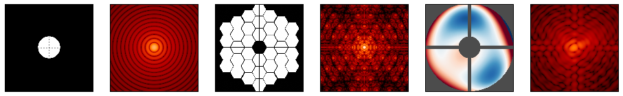

.. _photon_collection:

========================
Photon Collection models
========================

.. currentmodule:: pyxel.models.photon_collection

Photon generation models are used to add photons to :py:class:`~pyxel.data_structure.Photon` array
inside the :py:class:`~pyxel.detectors.Detector` object. At the beginning the :py:class:`~pyxel.data_structure.Photon`
array is an array of zeros. Multiple photon generation models can be linked together one after another.
The values in the :py:class:`~pyxel.data_structure.Photon` array represent photon flux,
so number of photons per pixel area per second. Time scale of the incoming flux can be changed in the model arguments.

.. _photon_collection_create_store_detector:

Create and Store a detector
===========================

The models :ref:`photon_collection_save_detector` and :ref:`photon_collection_load_detector`
can be used respectively to create and to store a :py:class:`~pyxel.detectors.Detector` to/from a file.

These models can be used when you want to store or to inject a :py:class:`~pyxel.detectors.Detector`
into the current :ref:`pipeline`.

.. _photon_collection_save_detector:

Save detector
-------------

This model saves the current :py:class:`~pyxel.detectors.Detector` into a file.
Accepted file formats are ``.h5``, ``.hdf5``, ``.hdf`` and ``.asdf``.

.. code-block:: yaml

    - name: save_detector
      func: pyxel.models.save_detector
      enabled: true
      arguments:
        filename: my_detector.h5

.. autofunction:: pyxel.models.save_detector

.. _photon_collection_load_detector:

Load detector
-------------

This model loads a :py:class:`~pyxel.detectors.Detector` from a file and injects it in the current pipeline.
Accepted file formats are ``.h5``, ``.hdf5``, ``.hdf`` and ``.asdf``.

.. code-block:: yaml

    - name: load_detector
      func: pyxel.models.load_detector
      enabled: true
      arguments:
        filename: my_detector.h5

.. autofunction:: pyxel.models.load_detector

.. _Load image:

Load image
==========

:guilabel:`Photon` → :guilabel:`Photon`

With this model you can add photons to :py:class:`~pyxel.detectors.Detector` by loading an image from a file.
Accepted file formats are ``.npy``, ``.fits``, ``.txt``, ``.data``, ``.jpg``, ``.jpeg``, ``.bmp``,
``.png`` and ``.tiff``. Use argument ``position`` to set the offset from (0,0) pixel
and set where the input image is placed onto detector. You can set preset positions with argument ``align``.
Values outside of detector shape will be cropped.
Read more about placement in the documentation of function :py:func:`~pyxel.util.fit_into_array`.
With ``multiplier`` you can multiply the photon number by a custom float,
and ``time_scale`` is to set the time scale of the incoming photons, default is 1 second.
By setting ``convert_to_photons`` to ``true`` together with ``bit_resolution``,
the model converts the values of loaded image array from ADU
to photon numbers for each pixel using the Photon Transfer Function.
:math:`\mathit{PTF} = \mathit{quantum\_efficiency} \cdot \mathit{charge\_to\_voltage\_conversion} \cdot \mathit{pre\_amplification} \cdot \mathit{adc\_factor}`.

ADC conversion factor in this case is :math:`\frac{\max(\mathit{characteristics} \cdot \mathit{voltage\_range})}{2^{\mathit{bit\_resolution}}}`.

Example of the configuration file:

.. code-block:: yaml

    - name: load_image
      func: pyxel.models.photon_collection.load_image
      enabled: true
      arguments:
        image_file: data/HorseHead.fits
        position: [0,0]
        convert_to_photons: true
        bit_resolution: 16

.. autofunction:: load_image

.. _Simple illumination:

Simple illumination
===================

:guilabel:`Photon` → :guilabel:`Photon`

With this model you can create different simple photon distributions: uniform, elliptical/circular
or rectangular, by setting the argument ``type``. The calculated photon count will be added to the
:py:class:`~pyxel.data_structure.Photon` array. User can specify the brightness of the object
with the argument ``level``. If the distribution is not ``uniform``, then the user also has to provide ``object_size``,
a list of tho integers, which are the diameters of the object in vertical and horizontal directions.
Object position can be changed with the argument ``object_position``,
a list of two integers specifying offset of the object center from pixel (0,0),
again in vertical and horizontal direction.
Use the argument ``time_scale`` to set the time scale of the incoming photon flux.

Example of the configuration file for a circular object:

.. code-block:: yaml

    - name: illumination
      func: pyxel.models.photon_collection.illumination
      enabled: true
      arguments:
          level: 500
          object_center: [250,250]
          object_size: [15,15]
          option: "elliptic"

.. autofunction:: illumination

.. _Stripe pattern:

Stripe pattern
==============

:guilabel:`Photon` → :guilabel:`Photon`

With this model you can add a two-dimensional square signal - a stripe pattern
to the :py:class:`~pyxel.data_structure.Photon` array. User can specify amplitude with argument ``level``,
the ``period`` of the square signal in unit of pixels and the ``angle`` of stripes.
The ``period`` should be a multiple of 2 and equal or larger than 2.
Argument ``startwith`` is used to flip zero and non-zero values.

Example of the configuration file:

.. code-block:: yaml

    - name: stripe_pattern
      func: pyxel.models.photon_collection.stripe_pattern
      enabled: true
      arguments:
        level: 1000
        period: 10
        startwith: 0
        angle: 5

.. autofunction:: stripe_pattern

.. _Shot noise:

Shot noise
==========

:guilabel:`Photon` → :guilabel:`Photon`

Use this model to add shot noise to the :py:class:`~pyxel.data_structure.Photon` array.
By default (no arguments provided), the model uses the Poisson distribution (``numpy.random.poisson``).
User can also set the argument  ``type`` to ``"normal"`` for normal distribution (``numpy.random.normal``).
As known, for large photon counts :math:`N` the Poisson distribution approaches the normal distribution
with standard deviation :math:`\sqrt{N}`, which is fixed in the model.
It is also possible to set the seed of the random generator with the argument ``seed``.

Example of the configuration file:

.. code-block:: yaml

  - name: shot_noise
    func: pyxel.models.photon_collection.shot_noise
    enabled: true
    arguments:
      type: "poisson"  # optional

.. autofunction:: shot_noise

.. _Physical Optics Propagation in PYthon (POPPY):

Physical Optics Propagation in PYthon (POPPY)
=============================================

:guilabel:`Photon` → :guilabel:`Photon`

POPPY (**P**\ hysical **O**\ ptics **P**\ ropagation in **PY**\ thon) model wrapper.

POPPY :cite:p:`10.1117/12.925230` simulated physical optical propagation including diffraction.
It implements a flexible framework for modeling Fraunhofer and Fresnel diffraction and point spread function formation,
particularly in the context of astronomical telescopes.

POPPY calculates the optical Point Spread Function of an optical system and applies the convolution.

* Developed by: Marshall Perrin et al., STScI
* Developed for: James Webb Space Telescope
* Documentation: https://poppy-optics.readthedocs.io
* Project link: https://github.com/spacetelescope/poppy

See details about POPPY Optical Element classes:
https://poppy-optics.readthedocs.io/en/stable/available_optics.html

    POPPY (Physical Optics Propagation in Python), Credit: STScI

Supported optical elements:

- ``CircularAperture``
- ``SquareAperture``
- ``RectangularAperture``
- ``HexagonAperture``
- ``MultiHexagonalAperture``
- ``ThinLens``
- ``SecondaryObscuration``
- ``ZernikeWFE``
- ``SineWaveWFE``

Example of the configuration file:

.. code-block:: yaml

    - name: optical_psf
      func: pyxel.models.photon_collection.optical_psf
      enabled: true
      arguments:
        fov_arcsec: 5               # FOV in arcseconds
        pixelscale: 0.01            # arcsec/pixel
        wavelength: 0.6e-6          # wavelength in meters
        optical_system:
          - item: CircularAperture
            radius: 3.0             # radius in meters        
        optical_system:
          - item: CircularAperture
            radius: 1.5             # radius in meters  
          - item: ThinLens
            radius: 1.2             # radius in meters  
            nwaves: 1
          - item: ZernikeWFE
            radius: 0.8             # radius in meters  
            coefficients: [0.1e-6, 3.e-6, -3.e-6, 1.e-6, -7.e-7, 0.4e-6, -2.e-6]
            aperture_stop: false

.. autofunction:: optical_psf

.. _Load PSF:

Load PSF
========

:guilabel:`Photon` → :guilabel:`Photon`

With this model you can load a Point Spread Function (:term:`PSF`) from a file.
The model will convolve the :py:class:`~pyxel.data_structure.Photon` array
inside the :py:class:`~pyxel.detectors.Detector` object with the loaded :term:`PSF`, using the
`astropy.convolution.convolve_fft <https://docs.astropy.org/en/stable/api/astropy.convolution.convolve_fft.html>`_
function.

Example of the configuration file:

.. code-block:: yaml

    - name: load_psf
      func: pyxel.models.photon_collection.load_psf
      enabled: true
      arguments:
        filename: "psf.npy"
        normalize_kernel: true  # optional

.. autofunction:: load_psf

.. _Wavelength dependence AIRS:

Wavelength dependence AIRS
==========================

:guilabel:`Photon` → :guilabel:`Photon`

This model was specially developed for the `ARIEL AIRS <https://sci.esa.int/web/ariel/-/59801-payload>`_ instrument.
It generates the photon over the array according to a specific dispersion pattern loading the PSF from a file.

Example of the configuration file:

.. code-block:: yaml

    - name: wavelength_dependence_airs
      func: pyxel.models.photon_collection.wavelength_dependence_airs
      enabled: true
        psf_filename: "data/CH1_big_cube_PSFs.fits"
        target_filename: "data/target_flux_SED_00005.dat"
        telescope_diameter_m1: 1.1 #m
        telescope_diameter_m2: 0.7 #m
        expand_factor: 18
        time_scale:  1.0

.. note:: This model is specific for the :term:`CMOS` detector.

.. autofunction:: wavelength_dependence_airs
