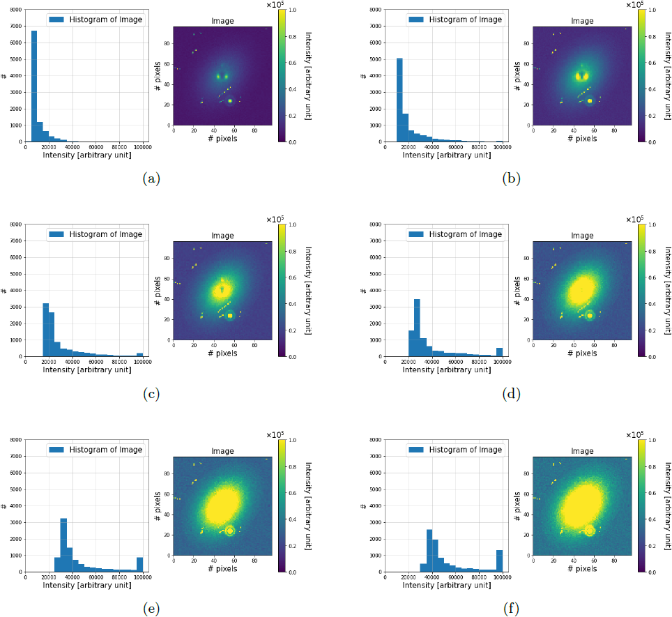

.. _readout_electronics:

==========================
Readout Electronics models
==========================

.. currentmodule:: pyxel.models.readout_electronics

Readout electronic models are used to add to and manipulate data in :py:class:`~pyxel.data_structure.Image` array
inside the :py:class:`~pyxel.detectors.Detector` object.
The data represents the image data in ADUs.
A readout electronic model, e.g. :ref:`Simple ADC`, is necessary to first convert from signal data stored in
:py:class:`~pyxel.data_structure.Signal` class to image data stored in :py:class:`~pyxel.data_structure.Image`.
Multiple models are available to add detector effects after.

.. _readout_electronics_create_store_detector:

Create and Store a detector
===========================

The models :ref:`readout_electronics_save_detector` and :ref:`readout_electronics_load_detector`
can be used respectively to create and to store a :py:class:`~pyxel.detectors.Detector` to/from a file.

These models can be used when you want to store or to inject a :py:class:`~pyxel.detectors.Detector`
into the current :ref:`pipeline`.

.. _readout_electronics_save_detector:

Save detector
-------------

This model saves the current :py:class:`~pyxel.detectors.Detector` into a file.
Accepted file formats are ``.h5``, ``.hdf5``, ``.hdf`` and ``.asdf``.

.. code-block:: yaml

    - name: save_detector
      func: pyxel.models.save_detector
      enabled: true
      arguments:
        filename: my_detector.h5

.. autofunction:: pyxel.models.save_detector
   :noindex:

.. _readout_electronics_load_detector:

Load detector
-------------

This model loads a :py:class:`~pyxel.detectors.Detector` from a file and injects it in the current pipeline.
Accepted file formats are ``.h5``, ``.hdf5``, ``.hdf`` and ``.asdf``.

.. code-block:: yaml

    - name: load_detector
      func: pyxel.models.load_detector
      enabled: true
      arguments:
        filename: my_detector.h5

.. autofunction:: pyxel.models.load_detector
   :noindex:

.. _Simple ADC:

Simple ADC
==========

:guilabel:`Signal` → :guilabel:`Image`

With this model you can convert :py:class:`~pyxel.data_structure.Signal`
array into :py:class:`~pyxel.data_structure.Image` mimicking an ideal Analog to Digital Converter (ADC).
The parameters ``adc_bit_resolution`` and ``adc_voltage_range`` from detector
:py:class:`~pyxel.detectors.Characteristics` are used.
Output data_type can also be specified with the parameter ``data_type``.
If not provided, data_type is determined based on ``detector.characteristics.adc_bit_resolution``.

Example of the configuration file:

.. code-block:: yaml

    - name: simple_adc
      func: pyxel.models.readout_electronics.simple_adc
      enabled: true
      arguments:
        data_type: uint32   # optional

.. autofunction:: simple_adc

.. _Simple amplification:

Simple amplification
====================

:guilabel:`Signal` → :guilabel:`Signal`

Amplify signal using gain from the output amplifier (in V/V) and
the signal processor (in V/V).

Example of the configuration file:

.. code-block:: yaml

    - name: simple_amplifier
      func: pyxel.models.readout_electronics.simple_amplifier
      enabled: true

.. autofunction:: simple_amplifier

.. _Dead time filter:

Dead time filter
================

:guilabel:`Phase` → :guilabel:`Phase`

This model only applies to the :py:class:`~pyxel.detectors.MKID` detector.

There is a maximum limit to the achievable count rate, which is inversely proportional to the minimum distance in time
between distinguishable pulse profiles: the so-called “dead time”, which is fundamentally determined by the recombination
time of quasi-particles re-forming Cooper pairs. The following is a mosaic of simulations---from
:cite:p:`2020:prodhomme`---showing the effect of temporal saturation for an MKID-array, which leads to an intensity
saturation; by incrementally increasing the brightness level in the field of view, from (a) to (f). The effect appears
when the interval between the arrival time of two photons is smaller than the dead time of the affected MKIDs in the
array, assuming an ideal read-out bandwidth. The sequence of associated histograms shows how the counts ($\#$) move
towards higher intensities, until the wall of :math:`10^5` (in arbitrary units) is reached.

Example of the configuration file:

.. code-block:: yaml

    - name: dead_time_filter
      func: pyxel.models.readout_electronics.dead_time_filter
      enabled: true
      arguments:
        tau_0: 4.4e-7
        n_0: 1.72e10
        t_c: 1.26
        v: 30.0
        t_op: 0.3
        tau_pb: 2.8e-10
        tau_esc: 1.4e-10
        tau_sat: 1.0e-3

.. note:: This model is specific to the :term:`MKID` detector.

.. autofunction:: dead_time_filter

.. _SAR ADC:

SAR ADC
=======

:guilabel:`Signal` → :guilabel:`Image`

Digitize signal array using SAR (Successive Approximation Register) :term:`ADC` logic.
The parameters ``adc_bit_resolution`` and ``adc_voltage_range`` from detector
:py:class:`~pyxel.detectors.Characteristics` are used.

Example of the configuration file:

.. code-block:: yaml

    - name: sar_adc
      func: pyxel.models.readout_electronics.sar_adc
      enabled: true

.. autofunction:: sar_adc

.. _SAR ADC with noise:

SAR ADC with noise
==================

:guilabel:`Signal` → :guilabel:`Image`

Digitize signal array using :term:`SAR` (Successive Approximation Register) :term:`ADC`
logic with noise.
The parameters ``adc_bit_resolution`` and ``adc_voltage_range`` from detector
:py:class:`~pyxel.detectors.Characteristics` are used.

Example of the configuration file for ``adc_bit_resolution`` equals to 8 bits:

.. code-block:: yaml

    - name: sar_adc_with_noise
      func: pyxel.models.readout_electronics.sar_adc_with_noise
      strengths: [0., 0., 0., 0., 0.1, 0.2, 0.3, 0.1]
      noises: [0.1, 0.1, 0.1, 0.1, 0.1, 0.1, 0.1, 0.1]
      enabled: true

.. autofunction:: sar_adc_with_noise

.. _Simple phase conversion:

Simple phase conversion
=======================

:guilabel:`Phase` → :guilabel:`Image`

With this model you can convert :py:class:`~pyxel.data_structure.Phase`
array into :py:class:`~pyxel.data_structure.Image`, given a hard-coded multiplicative conversion factor.

Example of the configuration file:

.. code-block:: yaml

    - name: simple_phase_conversion
      func: pyxel.models.readout_electronics.simple_phase_conversion
      enabled: true

.. note:: This model is specific to the :term:`MKID` detector.

.. autofunction:: simple_phase_conversion
