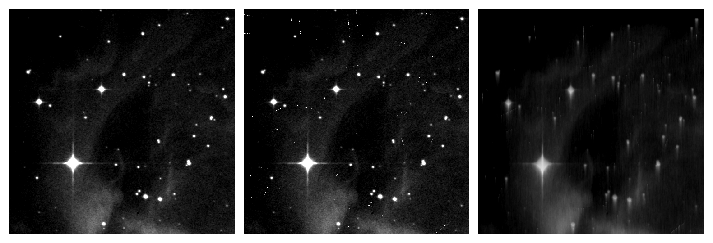

.. _introduction:

============
Introduction
============

**Pyxel** :cite:`2020:prodhomme` **is a novel, open-source, modular
Python software framework designed
to host and pipeline models (analytical, numerical, statistical) simulating
different types of detector effects on images produced by Charge-Coupled
Devices (** :term:`CCD` **), Monolithic, and Hybrid** :term:`CMOS` **imaging sensors.**

Users can provide one or more input images to Pyxel, set the detector and
model parameters via a user interface (configuration file)
and select which effects to simulate: cosmic rays, detector
Point Spread Function (PSF), electronic noises, Charge Transfer Inefficiency
(CTI), persistence, dark current, charge diffusion, optical effects, etc.
The output is one or more images including the simulated detector effects
combined.

    Examples of output images created using Pyxel.
    Left: original image;
    centre: tracks of cosmic ray protons have been added;
    right: in addition to the cosmic ray protons tracks the effects
    of lower full well capacity and charge transfer inefficiency have been added.

On top of its model hosting capabilities, the framework also provides a set
of basic image analysis tools and an input image generator as well. It also
features a parametric mode to perform parametric and sensitivity analysis,
and a model calibration mode to find optimal values of its parameters
based on a target dataset the model should reproduce.

A majority of Pyxel users are expected to be detector scientists and
engineers working with instruments - using detectors - built for astronomy
and Earth observation, who need to perform detector simulations, for example
to understand laboratory data, to derive detector design specifications for
a particular application, or to predict instrument and mission performance
based on existing detector measurements.

One of the main purposes of this new tool is to share existing resources
and avoid duplication of work. For instance, detector models
developed for a certain project could be reused by
other projects as well, making knowledge transfer easier.

Quickstart Setup
================

The best way to get started and learn Pyxel are the :doc:`examples`.

For convenience we provide a pre-defined conda environment file,
so you can get additional useful packages together with Pyxel in a virtual isolated environment.

First install `Miniconda <https://docs.conda.io/en/latest/miniconda.html>`_ and then just execute the following
commands in the terminal:

.. tip::

    Alternatively, you can use `Mamba <https://mamba.readthedocs.io>`_.
    Mamba is an alternative package manager that support most of conda’s command but
    offers higher installation speed and more reliable environment solutions.
    To install ``mamba`` in the Conda base environment:

    .. code-block:: bash

        conda install mamba -n base -c conda-forge

    then you can replace command ``conda`` by ``mamba``.

.. tab:: Linux, MacOS, Windows (WSL)

    .. code-block:: bash

        curl -O https://esa.gitlab.io/pyxel/doc/latest/pyxel-1.5-environment.yaml
        conda env create -f pyxel-1.5-environment.yaml

.. tab:: Windows (Powershell)

    .. code-block:: bash

        wget https://esa.gitlab.io/pyxel/doc/latest/pyxel-1.5-environment.yaml -outfile "pyxel-1.5-environment.yaml"
        conda env create -f pyxel-1.5-environment.yaml

Once the conda environment has been created you can active it using:

.. code-block:: bash

    conda activate pyxel-1.5

You can now proceed to download the Pyxel tutorial notebooks.
The total size to download is ~200 MB.

Select the location where you want to install the tutorials and datasets and
proceed with the following command to download them in folder ``pyxel-examples``:

.. code-block:: bash

    pyxel download-examples

Finally start a notebook server by executing:

.. code-block:: bash

    cd pyxel-examples
    jupyter lab

Now, you can skip the installation guide :doc:`install` and go directly to the tutorials and
explore the examples in :doc:`examples` to learn how to use Pyxel.

Getting started
===============

Are you new to Pyxel ? This is the place to start !

1. Start with installation guide in :doc:`install`.
2. Once ready you can learn how to run Pyxel in :doc:`running`.
3. Don't forget to take a look at :doc:`get_help` page.
4. Follow the tutorials and explore the examples in :doc:`examples` to learn how to use Pyxel.
